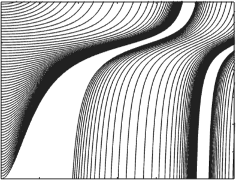
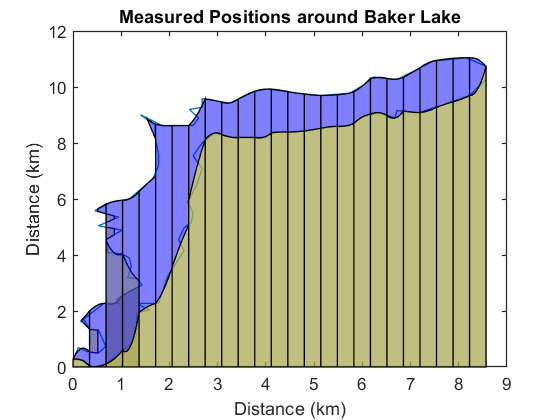

# Applied Partial Differential Equations

 or 

**Curriculum Module**

_Created with R2024a. Compatible with R2024a and later releases._

# Information

This curriculum module contains interactive [MATLAB® live scripts](https://www.mathworks.com/products/matlab/live-editor.html) that teach a variety of topics suitable for a first class in partial differential equations.

## Background

You can use these live scripts as demonstrations in lectures, class activities, or interactive assignments outside class. This module covers classification of second\-order PDEs, solving first order wave equations analytically, solving second order wave equations numerically, systems of partial differential equations, and implementing both explicit and implicit finite difference methods. It also includes examples of shocks and rarefaction waves in traffic, diffusion of carbon through iron, a chemical morphogenesis model, a thermal model of a battery, and an approach to modeling an ultrasound.

The instructions inside the live scripts will guide you through the exercises and activities. Get started with each live script by running it one section at a time. To stop running the script or a section midway (for example, when an animation is in progress), use the  Stop button in the **RUN** section of the **Live Editor** tab in the MATLAB Toolstrip.

## Contact Us

Contact the [MathWorks teaching resources team](mailto:onlineteaching@mathworks.com) if you would like to provide feedback or if you have a question.

## Prerequisites

This module assumes fluent knowledge of single variable calculus. If you would like to brush up on these topics, you could review with the calculus courseware:

-  [**Calculus: Integrals** ](https://www.mathworks.com/matlabcentral/fileexchange/105740-calculus-integrals)is available on  or  or [GitHub](https://github.com/MathWorks-Teaching-Resources/Calculus-Integrals)  
-  [**Calculus: Derivatives**](https://www.mathworks.com/matlabcentral/fileexchange/99249-calculus-derivatives) is available on  or  or [GitHub](https://github.com/MathWorks-Teaching-Resources/Calculus-Derivatives)  

## Getting Started
### Accessing the Module
### **On MATLAB Online:**

Use the  link to download the module. You will be prompted to log in or create a MathWorks account. The project will be loaded, and you will see an app with several navigation options to get you started.

### **On Desktop:**

Download or clone this repository. Open MATLAB, navigate to the folder containing these scripts and double\-click on [AppliedPDEs.prj](https://matlab.mathworks.com/open/github/v1?repo=MathWorks-Teaching-Resources/AppliedPDEs&project=AppliedPDEs.prj). It will add the appropriate files to your MATLAB path and open an app that asks you where you would like to start. 

Ensure you have all the required products (listed below) installed. If you need to include a product, add it using the Add\-On Explorer. To install an add\-on, go to the **Home** tab and select   **Add-Ons** > **Get Add-Ons**. 

## Products

MATLAB is used throughout. Tools from the Symbolic Math Toolbox™ are used frequently as well. The Partial Differential Equation Toolbox™ is used in <samp>ReactionDiffusion.mlx</samp>, in an extension example.

# Scripts
## [**Classification.mlx**](Scripts/Classification.mlx) 
|     | **In this script, students will...**    -  Review the terminology of classifying differential equations including homogeneity, order, and linearity.    -  Classify second\-order PDEs as elliptic, parabolic, or hyperbolic.    | **Academic disciplines**    -  Mathematics     |
| :-- | :-- | :-- |

## [**MethodOfCharacteristics.mlx**](Scripts/MethodOfCharacteristics.mlx) 
|     | **In this script, students will...**    -  Solve a transport equation using the method of characteristic lines.    -  Investigate applying the method of characteristics to first order 1\-D PDEs with nonconstant coefficients.    | **Academic disciplines**    -  Mathematics     |
| :-- | :-- | :-- |

## [**TrafficModelReal.mlx**](Scripts/TrafficModel.mlx) 
|     | **In this script, students will...**    -  Calculate a simple traffic model involving a nonlinear transport equation.    -  Identify and resolve rarefaction regions in a characteristic plot.    -  Identify and resolve shocks in a characteristic plot.    | **Academic disciplines**    -  Mathematics     |
| :-- | :-- | :-- |

## [**FiniteDifference.mlx**](Scripts/FiniteDifference.mlx) 
|     | **In this script, students will...**    -  Implement an explicit method.    -  Implement an implicit method    -  Implement a Crank\-Nicolson solver    | **Academic disciplines**    -  Mathematics     |
| :-- | :-- | :-- |

## [**Diffusion.mlx**](Scripts/Diffusion.mlx) 
|     | **In this script, students will...**    -  Explore the basic theory of diffusion and the diffusion equation.    -  Implement a finite difference solution for the diffusion equation.    -  Visualize the results of diffusion simulations.    | **Academic disciplines**    -  Mathematics    -  Materials science     |
| :-- | :-- | :-- |

## [**ReactionDiffusion.mlx**](Scripts/ReactionDiffusion.mlx) 
|     | **In this script, students will...**    -  Explore diffusion equation.    -  Implement a finite difference solution for the diffusion equation.    -  Visualize the results of diffusion simulations.    | **Academic disciplines**    -  Mathematics    -  Chemical engineering     |
| :-- | :-- | :-- |

## [**Ultrasound.mlx**](Scripts/Ultrasound.mlx) 
|    Credit: [Terry J. DuBose](https://en.wikipedia.org/w/index.php?curid=19500021)    | **In this script, students will...**    -  Identify the necessary initial and boundary value knowledge required to numerically approximate a second\-order wave equation.    -  Explore the basic theory of solving differential equations with boundary conditions.    -  Identify challenges involved in numerically solving a simple\-looking PDE.    | **Academic disciplines**    -  Mathematics    -  Medical technology    -  Acoustics     |
| :-: | :-- | :-- |

## [**BatteryThermalModel.mlx**](Scripts/BatteryThermalModel.mlx) 
|     | **In this script, students will...**    -  Explore the basic theory of the heat equation.    -  Use cylindrical coordinates to model a battery cell.    -  Implement a variety of initial conditions and visualize the results.    | **Academic disciplines**    -  Mathematics    -  Electrical engineering     |
| :-- | :-- | :-- |

# License

The license for this module is available in the [LICENSE.md](https://github.com/MathWorks-Teaching-Resources/Applied-PDEs/blob/release/LICENSE.md).

# Related Courseware Modules
| **Courseware Module**    | **Sample Content**    | **Available on:**     |
| :-- | :-- | :-- |
| [**Numerical Methods with Applications**](https://www.mathworks.com/matlabcentral/fileexchange/111490-numerical-methods-with-applications)    |     |         [GitHub](https://github.com/MathWorks-Teaching-Resources/Numerical-Methods-with-Applications)      |
|  [**Fourier Analysis**](https://www.mathworks.com/matlabcentral/fileexchange/106725-fourier-analysis)     |     |         [GitHub](https://github.com/MathWorks-Teaching-Resources/Fourier-Analysis)     |

Or feel free to explore our other [modular courseware content](https://www.mathworks.com/matlabcentral/fileexchange/?q=tag%3A%22courseware+module%22&sort=downloads_desc_30d).

# Educator Resources
-  [Educator Page](https://www.mathworks.com/academia/educators.html) 

# Contribute 

Looking for more? Find an issue? Have a suggestion? Please contact the [MathWorks teaching resources team](mailto:%20onlineteaching@mathworks.com). If you want to contribute directly to this project, you can find information about how to do so in the [CONTRIBUTING.md](https://github.com/MathWorks-Teaching-Resources/Applied-PDEs/blob/release/CONTRIBUTING.md)  page on GitHub.

 *©* Copyright 2024 The MathWorks™, Inc

